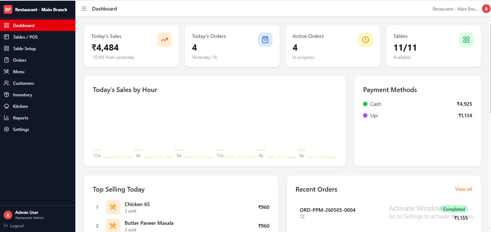
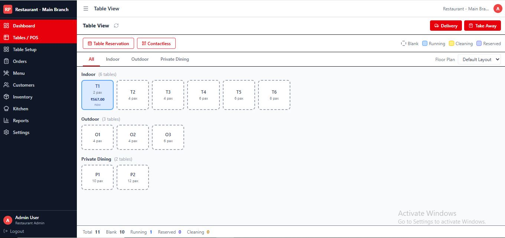
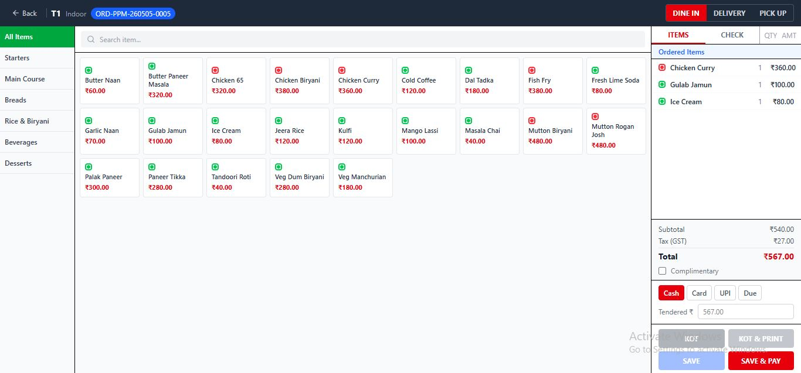
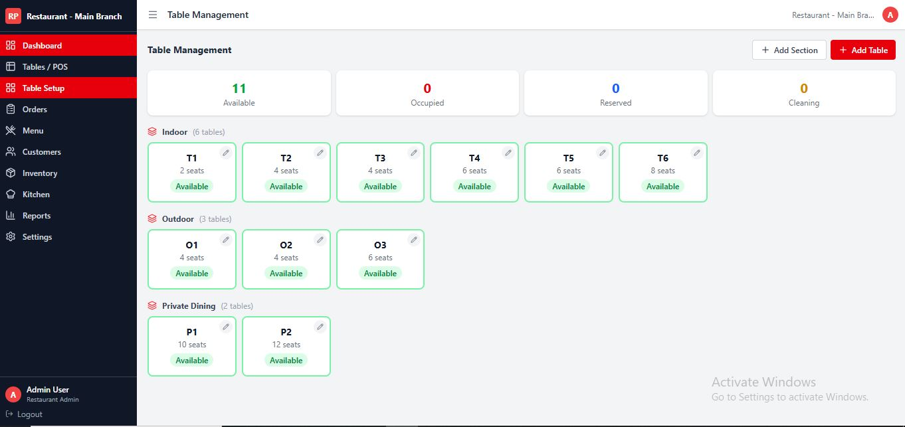
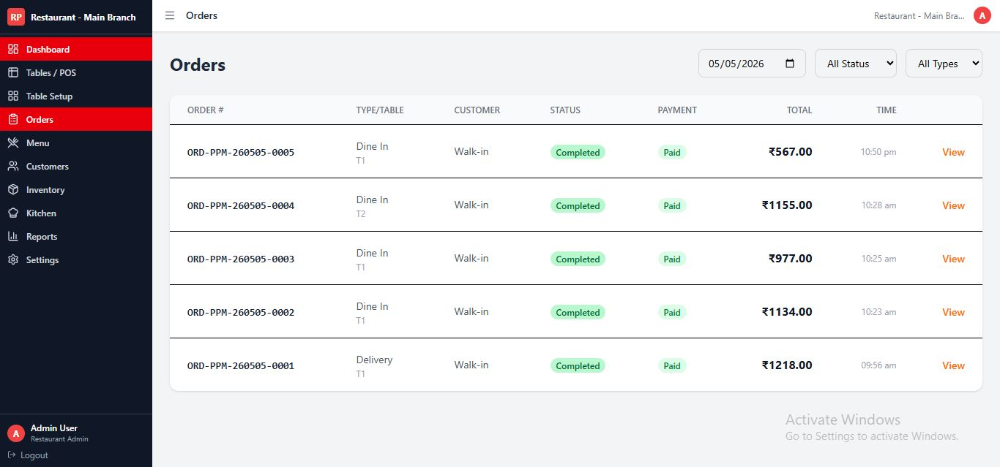
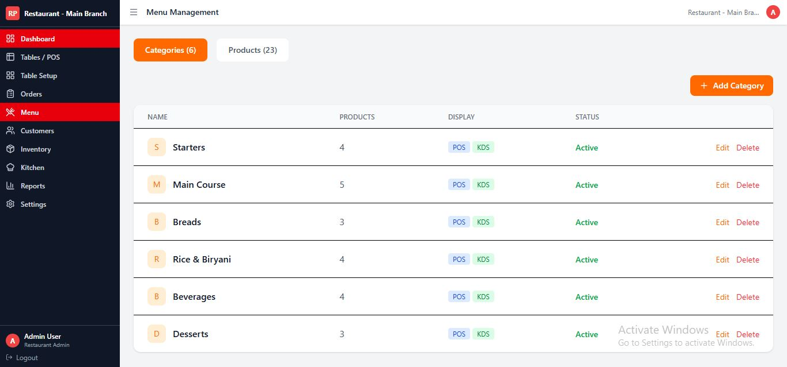
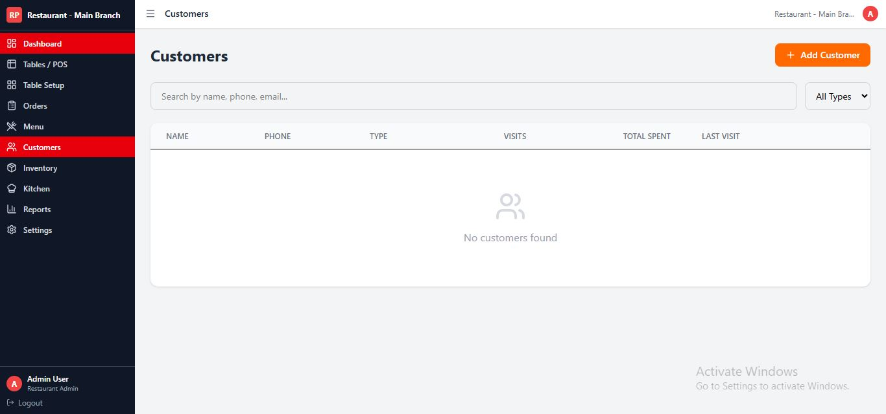
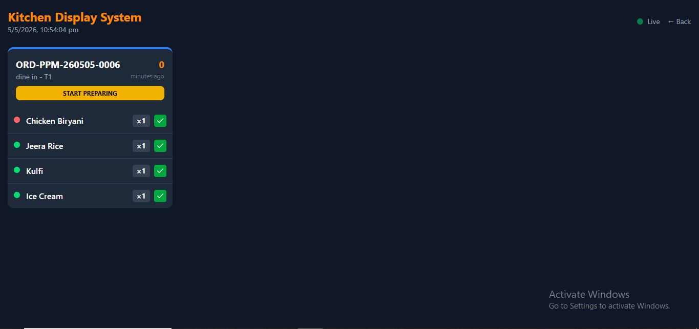
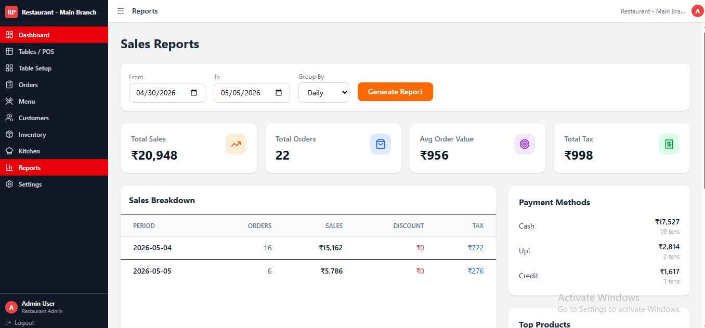
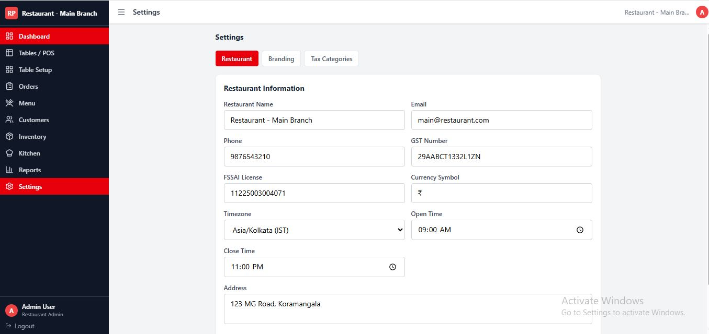

# Restaurant POS System

A full-featured Restaurant Point of Sale (POS) system built with **Laravel 13** and **Vue.js 3**. Designed for restaurants, cafes, and food businesses to manage orders, tables, inventory, staff, and more — all from a single dashboard.

## Screenshots

<table>
  <tr>
    <td align="center"><b>Dashboard</b><br/></td>
    <td align="center"><b>Tables / POS</b><br/></td>
  </tr>
  <tr>
    <td align="center"><b>POS Terminal</b><br/></td>
    <td align="center"><b>Table Management</b><br/></td>
  </tr>
  <tr>
    <td align="center"><b>Orders</b><br/></td>
    <td align="center"><b>Menu Management</b><br/></td>
  </tr>
  <tr>
    <td align="center"><b>Customers</b><br/></td>
    <td align="center"><b>Kitchen Display System</b><br/></td>
  </tr>
  <tr>
    <td align="center"><b>Sales Reports</b><br/></td>
    <td align="center"><b>Settings</b><br/></td>
  </tr>
</table>

## Features

- **POS Terminal** — Fast order entry with support for Dine-in, Takeaway, and Delivery
- **Table Management** — Interactive floor plan with real-time table status
- **Kitchen Display System (KDS)** — Live order queue for kitchen staff
- **Menu Management** — Categories, products, variants, and addon groups
- **Order Management** — Full order lifecycle from placement to payment
- **Customer Management** — Customer profiles and wallet support
- **Inventory Management** — Stock tracking and purchase orders
- **Reports & Analytics** — Sales reports and business insights
- **Roles & Permissions** — Granular access control per staff role
- **Multi-restaurant Support** — Organization-level multi-branch management
- **Authentication** — Secure API auth via Laravel Sanctum

## Tech Stack

| Layer | Technology |
|-------|-----------|
| Backend | Laravel 13 (PHP 8.3) |
| Frontend | Vue.js 3 + Vite |
| State Management | Pinia |
| Routing | Vue Router 4 |
| Auth | Laravel Sanctum |
| Database | MySQL / SQLite |
| Styling | Tailwind CSS |

## Requirements

- PHP >= 8.3
- Composer
- Node.js >= 18
- MySQL or SQLite

## Installation

### 1. Clone the repository

```bash
git clone https://github.com/yasarkureshi/restaurant-pos-system.git
cd restaurant-pos-system
```

### 2. One-command setup

```bash
composer run setup
```

This will:
- Install PHP dependencies
- Copy `.env.example` to `.env` and generate app key
- Run database migrations
- Install Node.js dependencies
- Build frontend assets

### 3. Manual setup (if needed)

```bash
# Install PHP dependencies
composer install

# Copy environment file
cp .env.example .env
php artisan key:generate

# Configure your database in .env, then run migrations
php artisan migrate

# Install and build frontend
npm install
npm run build
```

### 4. Start development server

```bash
composer run dev
```

This starts Laravel server, queue worker, log watcher, and Vite dev server concurrently.

The app will be available at `http://localhost:8000`.

## Project Structure

```
├── app/
│   ├── Http/Controllers/API/   # REST API controllers
│   └── Models/                 # Eloquent models
├── database/migrations/        # Database schema
├── resources/
│   └── js/
│       ├── views/              # Vue page components
│       │   ├── pos/            # POS Terminal
│       │   ├── tables/         # Table & Floor Plan
│       │   ├── kds/            # Kitchen Display
│       │   ├── menu/           # Menu Management
│       │   ├── orders/         # Order Management
│       │   ├── inventory/      # Inventory
│       │   ├── customers/      # Customer Management
│       │   ├── reports/        # Reports
│       │   └── settings/       # Settings
│       ├── stores/             # Pinia state stores
│       ├── router/             # Vue Router config
│       └── api/                # API client
└── routes/                     # Laravel API routes
```

## API Endpoints

The backend exposes a REST API under `/api/`. Key endpoints include:

- `POST /api/auth/login` — Login
- `GET /api/dashboard` — Dashboard stats
- `GET /api/orders` — List orders
- `POST /api/orders` — Create order
- `GET /api/products` — Menu items
- `GET /api/tables` — Table list
- `GET /api/kds/orders` — Kitchen display orders
- `GET /api/inventory` — Inventory items
- `GET /api/reports` — Sales reports

## Running Tests

```bash
composer run test
```

## License

This project is open-source and available under the [MIT License](LICENSE).
